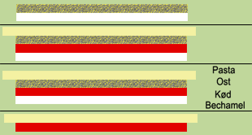

<link id="linkstyle" rel="stylesheet" href="foghorn.css">
<meta http-equiv="Content-Type" content="text/html;charset=UTF-8">

Lasagne
=======

# Trin

Løgene hakkes og brunes i olie, kød kommes i og brunes, derefter krydderier,
tomater og de revne gulerødder. Evt. lidt ekstra vand. Simre i ca. 15 minutter.
I mens laves den hvide sauce.

Smelt margarinen, kom melet i og spæd mælken i lidt af gangen. Så det bliver en
hvid sauce

I et ildfast fad som er smurt med margarine, lægges lagvis hvid sauce, kødsauce,
og lasagneplader. Osv. osv. Slut af med hvid sauce.

Drys evt. med revet ost.

Bages i ovnen ved 200 grader alm. ovn i 30 minutter.

# Ingredienser
* Kødsauce:
    * 500	Oksekød, hakket ca. 16% fedt
    * 0.5 	spsk.	Olie
    * 600	gram	Løg
    * 400	gram	Gulerødder
    * 1		laurbærblade
    * 2	ds.	Hakkede tomater, konserves
    * 1		Bouillonterning
    * Salt
    * Peber

* Hvid sauce:
    * 30	gram	Margarine
    * 2	spsk.	Hvedemel
    * 5	dl.	Sødmælk
    * Salt
    * Muskat
* 9 Lasagneplader
* 100	gram Revet ost, mozzarella 45+

Read more at http://www.dk-kogebogen.dk/opskrifter/visopskrift.php?id=850#GwTZ3iZ1Q8aGUGTK.99

Her er min yndlingsrækkefølge på lagene:

